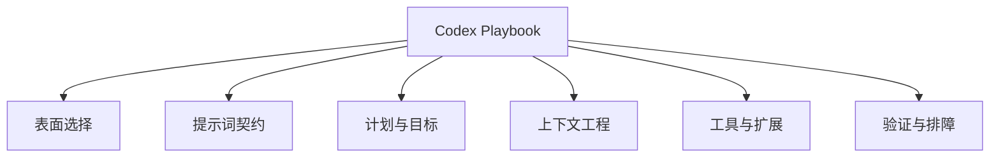

# Codex Playbook

把 Codex 当成长期协作系统的中文实战手册。

在线阅读：[chendahuang.com/playbook/codex](https://chendahuang.com/playbook/codex/)

## 全景图

## 目录

- [1. Codex 到底是什么](#_1-codex-到底是什么)
- [2. 表面选择](#_2-表面选择)
- [3. 提示词契约](#_3-提示词契约)
- [4. 计划、目标与执行](#_4-计划-目标与执行)
- [5. 上下文工程](#_5-上下文工程)
- [6. 配置、权限与安全](#_6-配置-权限与安全)
- [7. Skills、MCP、插件与子代理](#_7-skills-mcp-插件与子代理)
- [8. 实战工作流](#_8-实战工作流)
- [9. Review、CI 与发布](#_9-review-ci-与发布)
- [10. 排障手册](#_10-排障手册)
- [11. 可复制模板](#_11-可复制模板)
- [官方资源](#官方资源)

<main class="playbook-home">
  <section class="playbook-hero">
    

      <h1>Codex Playbook</h1>
      
把 Codex 变成可长期协作、可验证、能持续交付的工作系统。

    

    

      <a class="playbook-action primary" href="./chapters/01-overview">开始阅读<svg class="chapter-arrow" aria-hidden="true" viewBox="0 0 24 24" fill="none"><path d="M5 12h14M13 6l6 6-6 6" stroke="currentColor" stroke-width="1.8" stroke-linecap="round" stroke-linejoin="round"/></svg></a>
      <a class="playbook-action" href="#chapters">查看全部章节<svg class="chapter-arrow" aria-hidden="true" viewBox="0 0 24 24" fill="none"><path d="M5 12h14M13 6l6 6-6 6" stroke="currentColor" stroke-width="1.8" stroke-linecap="round" stroke-linejoin="round"/></svg></a>
    

  </section>

  <section class="playbook-section" id="chapters">
    

      <h2>按任务开始</h2>
      
选择当前最需要解决的问题，直接进入对应章节。

    

    

  <a class="chapter-link" href="./chapters/01-overview">
    01
    <strong class="chapter-title">## 1. Codex 到底是什么</strong>先理解 Codex 的能力边界、工作循环与模块框架。
    <svg class="chapter-arrow" aria-hidden="true" viewBox="0 0 24 24" fill="none"><path d="M5 12h14M13 6l6 6-6 6" stroke="currentColor" stroke-width="1.8" stroke-linecap="round" stroke-linejoin="round"/></svg>
  </a>
  <a class="chapter-link" href="./chapters/02-surfaces">
    02
    <strong class="chapter-title">## 2. 表面选择</strong>按任务选择 CLI、IDE、App、Cloud、Review 与 Sites。
    <svg class="chapter-arrow" aria-hidden="true" viewBox="0 0 24 24" fill="none"><path d="M5 12h14M13 6l6 6-6 6" stroke="currentColor" stroke-width="1.8" stroke-linecap="round" stroke-linejoin="round"/></svg>
  </a>
  <a class="chapter-link" href="./chapters/03-prompt-contract">
    03
    <strong class="chapter-title">## 3. 提示词契约</strong>把模糊需求写成可执行、可检查的任务契约。
    <svg class="chapter-arrow" aria-hidden="true" viewBox="0 0 24 24" fill="none"><path d="M5 12h14M13 6l6 6-6 6" stroke="currentColor" stroke-width="1.8" stroke-linecap="round" stroke-linejoin="round"/></svg>
  </a>
  <a class="chapter-link" href="./chapters/04-plans-goals-execution">
    04
    <strong class="chapter-title">## 4. 计划、目标与执行</strong>正确使用 Plan、Goal、执行步骤与小任务拆分。
    <svg class="chapter-arrow" aria-hidden="true" viewBox="0 0 24 24" fill="none"><path d="M5 12h14M13 6l6 6-6 6" stroke="currentColor" stroke-width="1.8" stroke-linecap="round" stroke-linejoin="round"/></svg>
  </a>
  <a class="chapter-link" href="./chapters/05-context-engineering">
    05
    <strong class="chapter-title">## 5. 上下文工程</strong>组织 AGENTS、README、日志、截图与项目真相源。
    <svg class="chapter-arrow" aria-hidden="true" viewBox="0 0 24 24" fill="none"><path d="M5 12h14M13 6l6 6-6 6" stroke="currentColor" stroke-width="1.8" stroke-linecap="round" stroke-linejoin="round"/></svg>
  </a>
  <a class="chapter-link" href="./chapters/06-config-permissions-security">
    06
    <strong class="chapter-title">## 6. 配置、权限与安全</strong>处理配置、sandbox、approval、secrets 与网络边界。
    <svg class="chapter-arrow" aria-hidden="true" viewBox="0 0 24 24" fill="none"><path d="M5 12h14M13 6l6 6-6 6" stroke="currentColor" stroke-width="1.8" stroke-linecap="round" stroke-linejoin="round"/></svg>
  </a>
  <a class="chapter-link" href="./chapters/07-skills-mcp-plugins">
    07
    <strong class="chapter-title">## 7. Skills、MCP、插件与子代理</strong>组合 Skills、MCP、插件、Hooks 与子代理。
    <svg class="chapter-arrow" aria-hidden="true" viewBox="0 0 24 24" fill="none"><path d="M5 12h14M13 6l6 6-6 6" stroke="currentColor" stroke-width="1.8" stroke-linecap="round" stroke-linejoin="round"/></svg>
  </a>
  <a class="chapter-link" href="./chapters/08-workflows">
    08
    <strong class="chapter-title">## 8. 实战工作流</strong>覆盖新项目、修复、UI、数据与发布等高频工作流。
    <svg class="chapter-arrow" aria-hidden="true" viewBox="0 0 24 24" fill="none"><path d="M5 12h14M13 6l6 6-6 6" stroke="currentColor" stroke-width="1.8" stroke-linecap="round" stroke-linejoin="round"/></svg>
  </a>
  <a class="chapter-link" href="./chapters/09-review-ci-release">
    09
    <strong class="chapter-title">## 9. Review、CI 与发布</strong>从代码修改一路走到 Review、CI、提交与上线。
    <svg class="chapter-arrow" aria-hidden="true" viewBox="0 0 24 24" fill="none"><path d="M5 12h14M13 6l6 6-6 6" stroke="currentColor" stroke-width="1.8" stroke-linecap="round" stroke-linejoin="round"/></svg>
  </a>
  <a class="chapter-link" href="./chapters/10-troubleshooting">
    10
    <strong class="chapter-title">## 10. 排障手册</strong>定位跑偏、上下文污染、工具缺失与权限阻塞。
    <svg class="chapter-arrow" aria-hidden="true" viewBox="0 0 24 24" fill="none"><path d="M5 12h14M13 6l6 6-6 6" stroke="currentColor" stroke-width="1.8" stroke-linecap="round" stroke-linejoin="round"/></svg>
  </a>
  <a class="chapter-link" href="./chapters/11-templates">
    11
    <strong class="chapter-title">## 11. 可复制模板</strong>直接复用项目约定、完成标准与常用模板。
    <svg class="chapter-arrow" aria-hidden="true" viewBox="0 0 24 24" fill="none"><path d="M5 12h14M13 6l6 6-6 6" stroke="currentColor" stroke-width="1.8" stroke-linecap="round" stroke-linejoin="round"/></svg>
  </a>
  <a class="chapter-link" href="./chapters/12-open-source">
    12
    <strong class="chapter-title">## 12. 开源参考：学结构，不抄全家桶</strong>学习优秀开源项目的结构与边界。
    <svg class="chapter-arrow" aria-hidden="true" viewBox="0 0 24 24" fill="none"><path d="M5 12h14M13 6l6 6-6 6" stroke="currentColor" stroke-width="1.8" stroke-linecap="round" stroke-linejoin="round"/></svg>
  </a>
  <a class="chapter-link" href="./chapters/13-resources">
    13
    <strong class="chapter-title">## 官方资源</strong>查找 Codex 与相关工具的官方资料。
    <svg class="chapter-arrow" aria-hidden="true" viewBox="0 0 24 24" fill="none"><path d="M5 12h14M13 6l6 6-6 6" stroke="currentColor" stroke-width="1.8" stroke-linecap="round" stroke-linejoin="round"/></svg>
  </a>
    

  </section>

  <section class="playbook-section">
    

      <h2>全部 Playbook</h2>
      
同一套阅读系统，各自保留一个清晰主题。

    

    <nav class="playbook-family" aria-label="全部 Playbook">
      <a class="playbook-family-link" href="https://chendahuang.com/playbook/cloudflare/"><strong>Cloudflare</strong>开发、部署与生产运维</a>
      <a class="playbook-family-link" href="https://chendahuang.com/playbook/codex/"><strong>Codex</strong>长期协作与可靠交付</a>
      <a class="playbook-family-link" href="https://chendahuang.com/playbook/feishu/"><strong>飞书</strong>协作、AI 与 Agent 工作流</a>
      <a class="playbook-family-link" href="https://chendahuang.com/playbook/macos/"><strong>macOS</strong>软件、效率与系统维护</a>
    </nav>
  </section>
</main>
