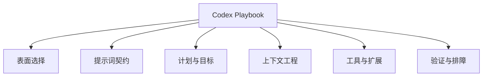

# Codex Playbook

把 Codex 当成长期协作系统的中文实战手册。

在线阅读：[chendahuang.com/playbook/codex](https://chendahuang.com/playbook/codex/)

## 全景图



## 目录

- [1. Codex 到底是什么](#_1-codex-到底是什么)
- [2. 表面选择](#_2-表面选择)
- [3. 提示词契约](#_3-提示词契约)
- [4. 计划、目标与执行](#_4-计划-目标与执行)
- [5. 上下文工程](#_5-上下文工程)
- [6. 配置、权限与安全](#_6-配置-权限与安全)
- [7. Skills、MCP、插件与子代理](#_7-skills-mcp-插件与子代理)
- [8. 实战工作流](#_8-实战工作流)
- [9. Review、CI 与发布](#_9-review-ci-与发布)
- [10. 排障手册](#_10-排障手册)
- [11. 可复制模板](#_11-可复制模板)
- [官方资源](#官方资源)

## 1. Codex 到底是什么

Codex 是 OpenAI 的编码代理，可以读代码、改文件、运行命令、使用工具、做 Review、调用连接器并持续推进任务。要让它稳定工作，需要把工程里的真相源、权限边界和完成标准交代清楚。

### 工作循环

一次完整任务通常包含这些动作：理解目标、读取上下文、制定步骤、修改文件、运行验证、解释结果，再根据反馈继续迭代。只让它生成一个函数，会丢掉前后的判断和验证。

<div class="play-grid">
  <div class="play-tile"><strong>它能执行</strong><span>可以读写本地仓库、跑测试、启动服务、看日志、用浏览器检查页面、调用 MCP 和连接器。</span></div>
  <div class="play-tile"><strong>它需要边界</strong><span>工作目录、权限、文件范围、架构约束、验收标准越清楚，越不容易做成“看起来对”。</span></div>
  <div class="play-tile"><strong>它会积累上下文</strong><span>线程里的文件、命令输出、截图、用户反馈都会影响后续判断；上下文脏了就要重新收口。</span></div>
  <div class="play-tile"><strong>它适合被制度化</strong><span>高频流程应该沉淀到 AGENTS.md、skills、hooks、CI 和 Review 规则里，而不是靠每次口头重复。</span></div>
</div>

### Codex 的几个表面

各入口适合的工作场景不同。

| 表面 | 最适合 | 不适合 |
| --- | --- | --- |
| Codex CLI | 本地仓库里的开发、批处理、脚本化操作、终端优先工作流 | 需要大量可视化审阅或浏览器交互的任务 |
| IDE Extension | 边写边改、看当前文件、局部重构、快速解释代码 | 长时间无人值守任务 |
| Codex App | 计划、实现、Review、连接器、浏览器、图片、文档和多步骤交互 | 只想要极快的单行补全 |
| Browser / Chrome / Computer Use | 网页验证、复用已登录浏览器、操作桌面应用 | 能用 API、CLI 或专用连接器稳定完成的结构化任务 |
| Codex Cloud | 并行任务、PR 修复、云端隔离执行、从 GitHub 派活 | 依赖本机私有文件或未推送状态的任务 |
| GitHub Review | PR 上的高信号审查和自动 Review | 需要当场运行本机私有环境的检查 |
| Sites | 快速创建、保存、部署 OpenAI 托管站点 | 已经有明确 Cloudflare/Vercel/自建部署要求的项目 |

选择口诀：贴着编辑器的小改用 IDE；仓库里的实操用 CLI 或 App；需要多工具、多轮交互、浏览器验证用 App；需要并行或 PR 自动化用 Cloud/GitHub；需要快速托管网页且不想管部署链路用 Sites。

### Codex 的模块框架

这份 Playbook 后面按六层展开。

1. 表面层：CLI、IDE、App、Cloud、GitHub Review、Sites。
2. 任务层：提示词、Plan mode、Goal mode、执行计划、验收条件。
3. 上下文层：文件、日志、截图、文档、真相源、连接器、记忆。
4. 定制层：AGENTS.md、config.toml、skills、plugins、MCP、hooks、automations。
5. 执行层：权限、sandbox、approval、命令、测试、浏览器、部署。
6. 治理层：Review、CI、安全、发布、排障、复盘。

## 2. 表面选择

### CLI：终端里的主力工位

CLI 适合仓库工作，因为它离 git、测试、构建、脚本、日志最近。你可以把 Codex 当成一个会自己读代码和运行命令的同事，让它在一个明确目录里完成任务。

适合 CLI 的任务：

- 修复一个可复现 bug，并运行对应测试。
- 给已有模块补一个小功能。
- 迁移配置、改脚本、更新依赖。
- 批量整理文档、生成迁移说明。
- 在 CI 失败日志基础上定位根因。

CLI 是否好用，很大程度取决于启动位置。进入正确仓库，确认分支和工作树状态，再把目标讲清楚。大型任务先读关键文件、确认边界和计划，不要直接丢一句“重构整个系统”。

### IDE Extension：局部上下文最强

IDE 插件更适合贴着当前文件工作。你正在看某个函数、某段类型、某个报错时，它能天然拿到打开文件和选区上下文。

适合 IDE 的任务：

- 解释当前模块的调用链。
- 根据选中代码补测试。
- 对一个组件做局部样式修正。
- 根据类型错误修改当前文件。
- 把一个小函数改得更清楚。

不要把 IDE 插件当作大型无人值守执行器。跨很多目录、要跑很多命令、要部署、要查外部系统的任务，更适合 Codex App 或 CLI。

### Codex App：多工具协作台

Codex App 适合复杂工作：你可以让它读图、控制浏览器、查连接器、管理线程、执行本地命令、展示 diff、做长任务。它特别适合“先想清楚，再改，再验证，再交付”的任务。

适合 App 的任务：

- 先做产品边界判断，再实现。
- 读设计图或截图后改 UI。
- 查询 Gmail、Calendar、Drive、GitHub 等连接器，再落地到代码或文档。
- 用浏览器打开本地站点，截图验证。
- 做多轮 Review 和修复。

App 的强项是把“人的判断”和“代理执行”放在同一个线程里。你可以边看它推进，边补充约束，而不是每一步都重新解释背景。

### Browser、Chrome 与 Computer Use

这三类入口看起来都能“操作界面”，但真相源和权限边界不同。选错入口，常见结果是丢登录态、拿不到 DevTools 信息，或者用视觉点击代替本来更稳定的结构化接口。

| 能力 | 什么时候用 | 关键边界 |
| --- | --- | --- |
| 内置 Browser | 打开网页、检查渲染结果、截图、做可重复的页面测试 | 使用 Codex 管理的浏览器环境，不默认继承日常 Chrome 的登录状态 |
| Chrome | 任务依赖你已经打开的标签页、Cookies、扩展或登录状态 | 通过 Chrome 插件连接现有 profile；网络、Console、DOM 和性能问题优先开 Developer mode |
| Computer Use | 操作 Finder、Excel、设计工具等桌面应用，或复现只发生在 GUI 里的问题 | 需要屏幕录制和辅助功能权限；能用专用插件、MCP 或 CLI 时优先走结构化接口 |
| Remote connections | 从 Codex App 连接远程 Mac、PC 或 SSH 主机上的项目 | 远端必须能启动 Codex app server；本地未同步文件和权限不会自动跟过去 |

选择口诀：普通网页验证用 Browser；必须复用现有登录态用 Chrome；跨出浏览器操作桌面 App 才用 Computer Use；代码和运行环境在另一台机器上时用 Remote connections。

### Cloud：并行和远程执行

Cloud 适合从 GitHub 派发任务。它会在隔离环境里 clone 仓库并工作，适合并行处理多个任务，或者从手机、浏览器、Slack、GitHub comment 触发。

使用 Cloud 前要确认三件事：

1. 当前代码已经 push 到 GitHub。
2. 云端环境能安装依赖并跑必要命令。
3. 任务不依赖本机未提交文件、私有配置或本地服务。

如果任务必须读你本机某个文件、使用已登录的 Chrome 状态、连接本机数据库，就优先用本地线程。

### Sites：快速把网页交给托管平台

Sites 是 OpenAI 托管站点的工作流：保存版本和发布版本是两个阶段。它适合快速把提示词生成的网站、网页应用或小游戏托管出去，也适合需要 D1/R2 这类持久能力的轻应用。

需要自有域名和既有 Cloudflare 发布链时，可以继续使用 Workers Static Assets；需要快速托管网页且不想维护部署链路时，再考虑 Sites。部署目标决定选型。

## 3. 提示词契约

### 四件事说清楚

Codex 官方最佳实践里最值得固定下来的提示词结构是四件事：Goal、Context、Constraints、Done when。把它们写清楚，Codex 就能更少猜测，更容易验证。

| 字段 | 你要写什么 | 示例 |
| --- | --- | --- |
| Goal | 你到底要改变什么 | “把登录页的手机号登录改成邮箱登录” |
| Context | 哪些文件、文档、错误、截图是真的 | “参考 `docs/auth.md` 和 `src/routes/login.tsx`” |
| Constraints | 哪些边界不能碰 | “不要改数据库 schema，不要引入新依赖” |
| Done when | 什么结果算完成 | “`pnpm test auth` 通过，手动访问 `/login` 正常” |

### 好提示词模板

```text
目标：
请把 [具体功能/问题] 做到 [明确状态]。

上下文：
- 真相源是 [文档/文件/日志/截图/线上行为]。
- 相关代码大概率在 [路径]。
- 当前问题是 [复现步骤/错误输出/用户反馈]。

约束：
- 不要改 [不该碰的模块]。
- 不要新增 [不必要依赖/配置/兼容层]。
- 遵循 [代码风格/设计规范/AGENTS.md]。

完成标准：
- 修改完成后运行 [命令]。
- 如果是 UI，启动本地服务并截图验证 [页面/视口]。
- 最后说明改了哪些文件、验证结果和剩余风险。
```

### 让 Codex 先找真相源

没有真相源时，Codex 只能猜。比较稳的流程是先定位权威文档、当前代码、运行态、日志、schema 和 API 合同，再开始实现。

常见真相源优先级：

1. 当前代码和测试。
2. 正式需求文档、架构文档、API 文档。
3. 数据库 schema、migration、线上配置。
4. 可复现错误、日志、截图、curl 输出。
5. 官方最新文档。
6. 过往聊天记忆或口头描述。

口头描述很重要，但它不能替代当前代码。你可以说“我怀疑是缓存问题”，但更好的提示词是“先证明请求链路哪里命中缓存，再决定是否改配置”。

### 拆小任务

Codex 能做大任务，但大任务也要有阶段。一个好拆法是：

1. 先读代码和文档，输出边界判断。
2. 再列修改计划，标出会碰哪些文件。
3. 实现一个可验证的小切片。
4. 跑验证命令。
5. Review 自己的 diff。
6. 交付结果和风险。

不要把“做一个完整后台系统”直接丢进去。可以先让 Codex 把数据模型、路由、权限和页面拆出来，再逐个实现。

## 4. 计划、目标与执行

### 什么时候先 Plan

任务复杂、需求模糊、跨模块、涉及线上风险、或者你还没想清楚时，先 Plan。Plan mode 的价值是让 Codex 暂时不动文件，先收集上下文、问关键问题、做方案对比。

适合先 Plan 的情况：

- “这个功能到底有没有必要？”
- “当前架构应该怎么改才长期站得住？”
- “线上失败根因是什么？”
- “我要做一个完整产品页，应该有哪些模块？”
- “迁移数据库，怎么保证不丢数据？”

Plan 不是形式主义。一个好计划必须能告诉你：真相源是什么、要改哪里、验证什么、风险在哪里、哪些事暂时不做。

### 什么时候开 Goal

Goal mode 适合长任务。它把“目标文本”当成持续推进和判断完成的标准，让 Codex 在多步任务中持续对齐。

适合 Goal 的任务：

- 从零搭一个站点并部署。
- 持续修复一批 CI 失败。
- 完成一轮大版本迁移。
- 整理一套文档和脚本。
- 调查线上问题直到有根因链。

Goal 要写得可验收。比如“优化网站”太虚，“把首页 Lighthouse Performance 提到 90 以上，并记录具体改动和截图”才是可执行目标。

### 执行计划文档

对于更长的工程任务，可以让 Codex 维护一个 `PLANS.md` 或 `docs/plans/xxx.md`。计划文档保留目标、边界、步骤和进度，让任务在上下文压缩后仍能继续推进。

计划文档至少包含：

- 当前目标。
- 已确认的事实。
- 不做的范围。
- 修改步骤。
- 验证命令。
- 风险和回滚方式。
- 当前进度。

当任务涉及数据库、生产部署、权限、安全、计费或很多文件时，计划文档的价值很高。它能把“我刚才为什么这么做”留在仓库里。

### 执行循环

让 Codex 按这个循环工作：

```text
读真相源 -> 提出计划 -> 小步修改 -> 本地验证 -> 自我 Review -> 修正 -> 交付总结
```

如果你发现 Codex 开始凭空发挥，立刻把它拉回第一步：重新读文件、日志或官方文档。不要继续在错误假设上叠代码。

## 5. 上下文工程

### AGENTS.md：仓库里的代理 README

`AGENTS.md` 是 Codex 最重要的长期上下文之一。它适合写团队约定、项目结构、命令、测试方式、Review 标准和禁区。

一个好的 `AGENTS.md` 不需要长，但要具体：

```md
# AGENTS.md

## 项目结构
- `src/` 是应用代码。
- `docs/` 是正式文档。
- `migrations/` 是数据库迁移，改 schema 必须新增 migration。

## 常用命令
- 安装依赖：`pnpm install`
- 本地开发：`pnpm dev`
- 构建：`pnpm build`
- 测试：`pnpm test`

## 工作约定
- 修改 UI 后必须用浏览器截图检查桌面和移动端。
- 修 bug 前先写清楚复现链路。
- 不要新增依赖，除非现有工具无法完成。

## Review 标准
- 优先找真实 bug、回归风险和缺失测试。
- 不把无关重构混进修复。
```

不要把 `AGENTS.md` 写成愿望清单。它应该来自真实摩擦：Codex 哪件事做错过两次，就把那条规则沉淀进去。

### config.toml：行为默认值

`config.toml` 适合放个人或项目级默认配置，例如模型、推理强度、sandbox、approval、MCP 服务器和实验功能。个人默认值放 `~/.codex/config.toml`，项目可信配置可以放 `.codex/config.toml`。

常见原则：

- 个人偏好放全局。
- 仓库共识放项目。
- 一次性实验放命令行或当前线程。
- 涉及强权限的配置先小范围试。

不要用配置掩盖任务不清楚。配置解决“怎么工作”，不解决“做什么”。

### 官方文档与 Context7

技术栈会变，Codex、OpenAI API、Cloudflare Workers、Wrangler 的细节都不能只靠记忆。需要最新技术文档时，优先用官方文档、OpenAI Docs MCP、Cloudflare docs，或者接入 Context7 这类开发文档 MCP。

Context7 的典型配置是：

```bash
codex mcp add context7 -- npx -y @upstash/context7-mcp
```

不要先假设 Context7 “没装”或“不可用”。先让 Codex 列出当前线程的工具；如果已经暴露 Context7，就直接用。没有时再检查 MCP 配置、授权和客户端重启状态。团队经常查前端框架、ORM、SDK 或云服务时，再把 Context7 配成 MCP，比每次靠模型记忆稳得多。

### 上下文不是越多越好

上下文越多，越容易把旧事实、错误假设和无关文件混进去。给 Codex 上下文时要做筛选。

更好的输入：

- “只看这三个文件和这个错误输出。”
- “先不要实现，先比较需求文档和当前代码是否一致。”
- “把生产日志里 500 的 Ray ID 和 Worker 日志对齐。”
- “这张截图是验收标准，改完后重跑截图。”

更差的输入：

- “你看整个项目自己改。”
- “应该就是某个缓存问题。”
- “大概照之前那个项目做。”
- “把所有地方都优化一下。”

### 记忆与复盘

Codex 可以在对话和本地记忆中保留偏好，但记忆不是当前事实。适合记忆的是用户偏好、项目长期约定、以前踩过的坑；不适合当作当前生产状态、最新价格、最新 API 行为。

每次重大任务结束后，可以让 Codex 做三件事：

1. 总结这次任务的根因和解决方案。
2. 抽出以后可复用的命令和检查清单。
3. 判断是否要更新 `AGENTS.md`、skill 或项目文档。

## 6. 配置、权限与安全

### sandbox 和 approval

Codex 的安全边界主要来自 sandbox 和 approval。sandbox 决定文件系统、网络和命令能访问哪里；approval 决定什么时候要向用户确认。

经验规则：

- 新仓库、陌生命令、生产操作：权限收紧。
- 已信任仓库、可回滚本地修改：可以提高自动化程度。
- 删除文件、重置 git、改生产数据、旋转密钥：必须明确确认。
- 读日志、跑测试、构建、格式化：通常可以自动执行。

生产操作仍然单独确认。把可验证的安全命令沉淀成规则，比直接放开所有权限更省时间。

### secrets 和外部账号

密钥永远不要写进提示词、README、代码块或提交记录。需要让 Codex 使用密钥时，走环境变量、平台 secret、Cloudflare secret、GitHub secret 或连接器授权。

给 Codex 的表达应该是：

```text
需要用到 OPENAI_API_KEY，但不要打印它。只检查环境变量是否存在；如果不存在，告诉我需要配置哪个 key。
```

而不是把 key 直接贴进聊天里。

### 本地和云端环境差异

本地线程能访问本机文件、依赖缓存、登录状态和私有配置。云端线程通常只能访问 GitHub 仓库和配置好的 secrets。很多“本地能跑，云端失败”的问题来自环境差异。

排查顺序：

1. 云端是否拿到了同一分支和同一 commit。
2. 依赖安装命令是否一致。
3. Node、pnpm、Python、系统库版本是否一致。
4. 环境变量和 secrets 是否配置。
5. 测试是否依赖本机文件或外部服务。

### 让验证成为安全网

安全不是只靠谨慎。让 Codex 每次改完都运行测试、类型检查、lint、构建、浏览器检查和 diff review，才是长期可靠的方式。

最小验证包：

```text
1. 运行与改动相关的测试。
2. 跑类型检查或构建。
3. 检查 git diff。
4. 如果是 UI，打开页面截图。
5. 如果是部署，访问线上 URL 做 smoke test。
```

## 7. Skills、MCP、插件与子代理

### Skills：可复用工作流

Skill 是一组可复用说明、参考资料和脚本。它适合把高频流程制度化，比如“发布流程”“PDF OCR”“Cloudflare 部署”“代码审查”“业务诊断”。

Skill 适合：

- 步骤固定但每次输入不同的流程。
- 需要读参考资料再执行的流程。
- 需要脚本辅助的流程。
- 团队希望共享的工作方式。

Skill 不适合：

- 一次性任务。
- 模糊想法。
- 还没跑通的流程。

写 skill 时，最重要的是 description。Codex 是否会自动选择它，取决于描述是否清楚说明触发场景。

### MCP：连接外部世界

MCP 是 Codex 连接外部工具和上下文的标准方式。你可以用 MCP 连接文档、浏览器、GitHub、Figma、Sentry、Linear、Context7、内部系统等。

MCP 的判断标准很简单：如果信息不在本地仓库里，而且需要被稳定读取或操作，就考虑 MCP。

常见用法：

- 用 OpenAI Docs MCP 查官方文档。
- 用 Context7 查最新框架文档。
- 用 GitHub MCP 读 PR、issue、workflow。
- 用浏览器 MCP 做页面测试和截图。
- 用 Figma MCP 读取设计稿。
- 用 Sentry MCP 读线上错误。

### 插件：可安装的能力包

插件是可分发的能力包，可以包含 skills、MCP 配置、连接器映射、资产和应用集成。团队内部如果有多条固定工作流，不想让每个人手动复制 skill，就可以考虑插件化。

判断是否需要插件：

| 情况 | 选择 |
| --- | --- |
| 只是你自己用 | 用户目录 skill |
| 某个仓库专用 | 仓库 `.agents/skills` |
| 多个仓库复用 | 用户 skill 或插件 |
| 团队分发并带 MCP/资产 | 插件 |

### Subagents：分工而不是分身

Subagent 适合把任务拆给不同角色。例如一个代理专门跑测试，一个代理专门查生产日志，一个代理专门做安全 Review。它的价值是聚焦，不是让多个代理同时乱改同一批文件。

适合 subagents 的场景：

- 大型调查任务，需要并行搜不同证据。
- Review 任务，需要安全、性能、产品逻辑分开看。
- 数据迁移，需要一个代理核对 schema，一个代理核对脚本。
- 复杂 UI，需要一个代理做视觉检查，一个代理做可访问性检查。

注意：不要让两个线程或两个代理同时修改同一文件。并行应该用于调查、验证、审查，而不是无协调地写代码。

### Hooks、Rules 和 Automations

这三类东西都能让 Codex 更稳定，但用途不同。

| 能力 | 适合做什么 | 不适合做什么 |
| --- | --- | --- |
| Hooks | 在命令或工具调用前后做检查、记录、阻断 | 替代人类判断 |
| Rules | 控制哪些命令能自动执行、哪些要确认、哪些禁止 | 表达复杂业务流程 |
| Automations | 定时提醒、周期性检查、监控稳定流程 | 临时一次性任务 |

先用 `AGENTS.md` 写清楚规则，再用 hooks/rules/CI 去机械执行。不要一开始就把所有流程塞进自动化。

## 8. 实战工作流

### 新仓库接手

让 Codex 接手新仓库时，不要直接让它改。先让它做侦察。

```text
请先不要修改文件。
请阅读 README、package.json、AGENTS.md、主要入口文件和测试配置，
总结这个项目的技术栈、启动命令、构建命令、测试命令、部署方式和风险点。
最后给出你建议我以后如何给这个项目下任务。
```

验收看什么：

- 是否找到了真实启动命令。
- 是否知道测试在哪里。
- 是否识别部署方式。
- 是否区分代码事实和推测。

### 修 bug

修 bug 的重点是先复现，再改。

```text
目标：修复 [bug]。
上下文：复现步骤是 [步骤]，错误输出是 [日志]。
要求：先证明当前 bug 的失败链路，再修改代码。
完成标准：相关测试通过，并说明根因、修改点和为什么不会影响其他路径。
```

不要只说“这里报错了帮我修”。好的修 bug 任务应该让 Codex 输出根因链：输入是什么，代码走到哪里，为什么失败，改了哪一层，验证了什么。

### 做功能

做功能最容易膨胀。你要提前写清楚“不做什么”。

```text
请实现 [功能]。
范围只包括 [页面/API/模块]。
不要新增权限系统、不要改数据库 schema、不要引入新依赖。
沿用现有组件和样式。
完成后运行 [测试/构建]。
```

如果功能涉及数据库、鉴权、计费或外部 API，先让 Codex 写实现计划，再动手。

### 做 UI

UI 任务不能只靠文字描述。最好给截图、设计稿、参考页面、品牌约束和验收视口。

```text
请修改这个页面的 UI。
目标用户是 [人群]，页面要感觉 [风格]。
参考截图是 [截图]。
约束：沿用当前设计系统，不新建 landing page，不添加无关说明文。
完成后启动本地服务，用桌面和移动端截图验证没有重叠、溢出和空白区域。
```

UI 验收要看：

- 首屏是否说清产品对象。
- 移动端是否不重叠。
- 文本是否不溢出按钮或卡片。
- 状态是否完整：loading、empty、error、disabled。
- 交互控件是否符合用户预期。

### 数据和迁移

涉及数据时，先备份、再 side-by-side 验证、最后切换。不要让 Codex 直接在生产库上“试一下”。

提示词：

```text
这是数据库迁移任务。
请先读取 schema、migration、当前行数和生产/开发差异。
先给迁移计划和回滚方案，不要执行写操作。
计划确认后再生成 migration 和验证 SQL。
完成标准：迁移前后关键表行数、约束和 smoke query 都一致。
```

### 部署

部署不是运行一个命令。部署任务要包括构建、发布、线上验证和回滚入口。

Cloudflare Worker 静态站的最小链路：

```text
pnpm install
pnpm build
wrangler deploy
curl -I https://your-domain.example
```

交付前还要确认：

- `wrangler.jsonc` 的 `name` 和 route 是否正确。
- `compatibility_date` 是否新鲜。
- 构建目录是否和 assets directory 一致。
- 自定义域名是否在 Cloudflare 账号下。
- 部署后线上 URL 是否返回 200。

## 9. Review、CI 与发布

### 让 Codex 自己 Review 一遍

实现后让 Codex 进入 Review 姿态，而不是只总结。

```text
请 review 你刚才的 diff。
优先找真实 bug、回归风险、安全问题、缺失测试和部署风险。
不要重复描述已经改了什么。
如果没有发现问题，也请说明剩余风险。
```

这一步很有价值，因为 Codex 在实现模式下会更关注完成任务，在 Review 模式下会更关注破坏面。

### GitHub Review

如果团队使用 GitHub，可以让 Codex 对 PR 做自动或手动 Review。手动方式通常是在 PR comment 里写 `@codex review`。仓库里有 `AGENTS.md` 时，Codex 会按最近的指导文件理解 Review 标准。

建议在 `AGENTS.md` 里写 Review guidelines：

```md
## Review guidelines

- 优先报告 P0/P1 的真实问题。
- 鉴权、权限、数据丢失、生产配置错误按高优先级处理。
- 只把文案小错当作低优先级，除非它影响用户理解。
```

### CI 失败修复

CI 失败时，不要让 Codex “重新跑一下”。先让它定位失败链。

```text
请修复这个 CI 失败。
先读取失败 job、失败命令和完整错误输出。
只修改与失败相关的文件。
本地运行同等命令验证。
最后说明根因、修复和为什么 CI 应该恢复。
```

如果 CI 依赖云端 secret 或外部服务，本地可能无法完全复现。这时 Codex 应该区分“已本地验证”和“需要云端再次验证”的部分。

### 发布说明

交付给人时，Codex 的最终输出应该包括：

- 改了什么。
- 为什么这么改。
- 跑了哪些验证。
- 线上地址或构建产物。
- 剩余风险。

最终总结不要写成流水账。用户需要知道“现在能不能用、怎么确认、哪里要小心”。

## 10. 排障手册

### Codex 跑偏了

先停实现，让它重新对齐：

```text
暂停修改。请列出你当前使用的假设、已读文件、计划改动和不确定点。
然后重新读取 [真相源]，只基于这些证据更新计划。
```

如果它已经改了很多文件，不要急着全部回滚。先让它列 diff 分组，判断哪些是任务相关，哪些是误改，再决定怎么处理。

### 结果看起来对但不可靠

常见原因：

- 没跑测试。
- 没打开页面。
- 没对齐真实 API。
- 使用了过时文档。
- 只改了前端没改后端合同。
- 只处理 happy path。

处理方式：

```text
请不要继续新增功能。
请列出当前实现依赖的所有假设，并逐条验证。
能用命令验证的就运行命令；不能验证的标成风险。
```

### 工具或 MCP 不可用

如果 Context7、OpenAI Docs MCP、GitHub、浏览器或其他工具不可用，先区分三种情况：

1. 工具没有安装。
2. 工具安装了但未授权。
3. 工具可用但当前线程没有暴露。

处理方式：

- 先让 Codex 列出当前可用工具。
- 如果是 MCP，检查 `config.toml`。
- 如果是连接器，检查是否安装和授权。
- 如果只是本线程没有暴露，重开线程或安装插件后重试。
- 需要最新文档时，用官方网页作为 fallback，并明确说明来源。

### 权限卡住

权限问题不要硬绕。先问：

- 这个命令是否真的需要非 sandbox 权限？
- 能否用只读命令先证明问题？
- 是否会修改生产、删除文件、暴露 secret？
- 是否可以缩小命令范围？

好的授权请求应该说明：要执行什么、为什么需要、影响范围是什么、失败如何回滚。

### 部署后线上不对

按链路查：

1. 构建产物是否是最新。
2. deploy 是否成功。
3. route/custom domain 是否指向正确 Worker。
4. 浏览器是否有缓存或 stale service worker。
5. Cloudflare cache 是否命中旧资源。
6. API 地址是否指向了错误环境。
7. 线上日志是否有报错。

不要只重复 deploy。重复 deploy 只能解决“刚才没发布成功”，不能证明根因。

## 11. 可复制模板

### 新任务模板

```text
目标：
[一句话说清楚要完成什么]

上下文：
- 相关文件：
- 相关文档：
- 当前错误/截图/日志：

约束：
- 不改：
- 不新增：
- 风格要求：

完成标准：
- 命令：
- 页面：
- 输出：
```

### AGENTS.md 模板

```md
# AGENTS.md

## 核心原则
- 始终先找当前代码和正式文档作为真相源。
- 不做无关重构。
- 修改 UI 后必须截图验证桌面和移动端。

## 项目命令
- 安装：`pnpm install`
- 开发：`pnpm dev`
- 构建：`pnpm build`
- 测试：`pnpm test`

## 代码约定
- 沿用现有目录结构和组件风格。
- 只在关键逻辑处写必要注释。
- 外部输入和 API 边界要验证，内部不做假想防御。

## 完成标准
- 相关测试通过。
- 构建通过。
- 总结修改、验证和风险。
```

### Skill 模板

```md
---
name: release-check
description: Use when preparing a release and needing build, test, changelog, deployment, and smoke-test checks.
---

1. Read the current branch, diff, package scripts, and deployment config.
2. Run the smallest relevant test and build commands.
3. Check the changelog or release notes if the project has one.
4. Deploy only when the user explicitly asks.
5. After deployment, run smoke checks and report the live URL.
```

### MCP 配置模板

```toml
[mcp_servers.context7]
command = "npx"
args = ["-y", "@upstash/context7-mcp"]

[mcp_servers.openaiDeveloperDocs]
url = "https://developers.openai.com/mcp"
```

### PR Review 模板

```text
请以代码审查姿态检查当前 diff。
只报告真实 bug、行为回归、安全风险、数据风险和缺失测试。
每条发现都要给文件和行号。
如果没有发现问题，请明确说没有发现阻断问题，并列出剩余风险。
```

### 发布模板

```text
请完成发布前检查。
1. 确认 git 状态和当前分支。
2. 运行安装、构建、测试。
3. 检查部署配置。
4. 部署到目标平台。
5. 访问线上 URL 做 smoke test。
6. 汇总版本、URL、验证结果和回滚入口。
```

## 12. 开源参考：学结构，不抄全家桶

开源项目主要用来查看 Codex 的真实接口、扩展格式和自动化边界。优先读官方仓库和开放规范；第三方工具只解决明确痛点，不要让它接管整个工作流。

| 需求 | 第一选择 | 值得吸收的部分 | 不要照搬什么 |
| --- | --- | --- | --- |
| 看 CLI 实现、issue 和 release | [openai/codex](https://github.com/openai/codex) | CLI、Rust 实现、配置和协议演进 | 未发布分支不等于稳定产品合同 |
| 看当前插件和 Skill 打包方式 | [openai/plugins](https://github.com/openai/plugins) | `.codex-plugin/plugin.json`、skills、MCP、hooks 和 marketplace 结构 | 不要一次安装整个目录 |
| 在 CI 里跑可重复任务 | [openai/codex-action](https://github.com/openai/codex-action) | `codex exec`、最小权限、prompt file 和结构化输出 | 不要把不可信 PR 文本直接当提示词 |
| 复现 Codex Cloud 基础环境 | [openai/codex-universal](https://github.com/openai/codex-universal) | 默认镜像、语言版本和本地 Docker 近似环境 | 它不是本地 Codex 的必装依赖 |
| 做跨 Agent 可复用 Skill | [agentskills/agentskills](https://github.com/agentskills/agentskills) | `SKILL.md` 开放格式和渐进加载 | 规范兼容不代表各客户端行为完全一样 |
| 在 macOS 看额度窗口 | [steipete/CodexBar](https://github.com/steipete/CodexBar) | 菜单栏额度、重置时间和多 provider 汇总 | 第三方读取会话或 cookie 前先看权限与隐私说明 |

::: warning 别再从旧仓库起步
[openai/skills](https://github.com/openai/skills) 已明确标记弃用。当前官方 Skill / Plugin 示例应看 `openai/plugins`；需要跨工具格式时再看 Agent Skills 规范。
:::

这套选择顺序很简单：**产品事实看官方文档，源代码和 release 看 `openai/codex`，扩展示例看 `openai/plugins`，跨客户端格式看 Agent Skills。** Stars 只能说明关注度，不能替代维护状态、权限模型和实际验证。

## 官方资源

- [Codex 开发者文档](https://learn.chatgpt.com/docs/developers)
- [Environments](https://learn.chatgpt.com/docs/environments/modes)
- [Codex SDK](https://learn.chatgpt.com/docs/codex-sdk)
- [App Server](https://learn.chatgpt.com/docs/app-server)
- [Hooks](https://learn.chatgpt.com/docs/hooks)
- [Codex Best Practices](https://learn.chatgpt.com/guides/best-practices)
- [Prompting 与 Goal mode](https://learn.chatgpt.com/docs/prompting)
- [AGENTS.md 指南](https://learn.chatgpt.com/docs/agent-configuration/agents-md)
- [Skills](https://learn.chatgpt.com/docs/build-skills)
- [MCP](https://learn.chatgpt.com/docs/extend/mcp?surface=cli)
- [内置 Browser](https://learn.chatgpt.com/docs/browser?surface=app)
- [Chrome 插件](https://learn.chatgpt.com/docs/chrome-extension)
- [Computer Use](https://learn.chatgpt.com/docs/computer-use)
- [Remote connections](https://learn.chatgpt.com/docs/remote-connections)
- [Execution Plans Cookbook](https://developers.openai.com/cookbook/articles/codex_exec_plans)
- [GitHub Review](https://learn.chatgpt.com/docs/third-party/github)
- [Cloudflare Workers Static Assets](https://developers.cloudflare.com/workers/static-assets/)
- [Wrangler 配置文档](https://developers.cloudflare.com/workers/wrangler/configuration/)
- [Cloudflare Workers Routes](https://developers.cloudflare.com/workers/configuration/routing/routes/)

> 最后核对：2026-07-11。Codex 的表面、权限和扩展能力更新很快，使用时以官方文档和当前客户端实际可见能力为准。

<div class="callout-strip">
  <strong>工作原则</strong>
  <span>给出真相源和边界，让 Codex 执行，再用测试、Review 和线上 smoke test 验证结果。</span>
</div>
